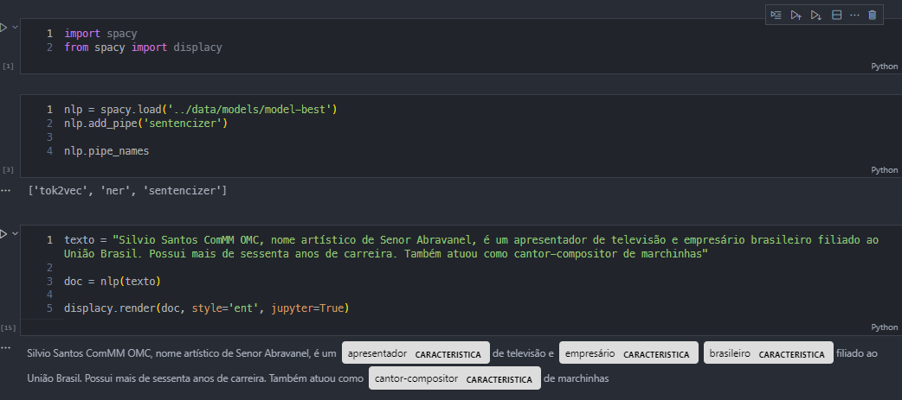

Pegando dados para o trabalho de PAA usando scraping e nlp

#### PT:
Código usado para extrair dados para o trabalho de PAA (não utilize o código para qualquer outra coisa, pois ele muito provavelmente não está 100% correto apenas funcionando para o caso específico).

#### EN:
Code used to extract data for the PAA project (don't use this code for anything else, because it is very likely not 100% correct only working for the specific case).

Observações:
- As biografias foram retiradas de um site de biografias de pessoas famosas.

PS: 
Dado que é um conjunto de dados pequeno e os dados não foram dispostos da melhor forma possível para fazer o treinamento acaba ocorrendo sobreajuste, então o modelo não é muito bom. Mas é um bom começo.

Provavelmente, utilizar apenas a abordagem de reconhecimento de entidades baseado em regras seria melhor e suficiente.

Exemplo do funcionamento:

